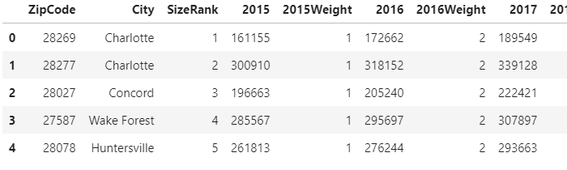
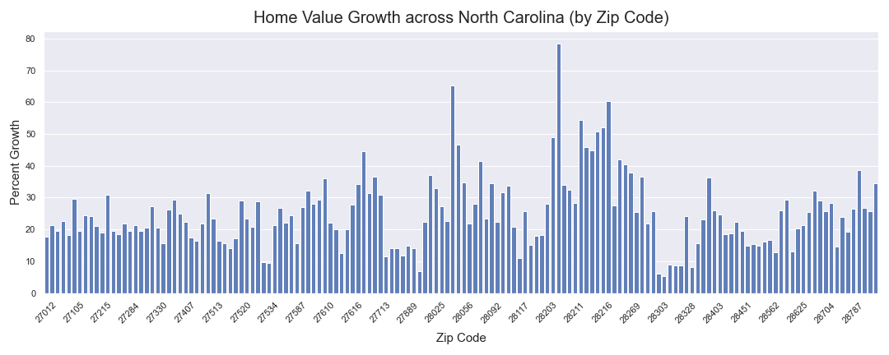
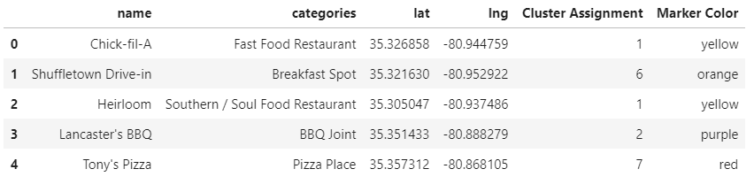
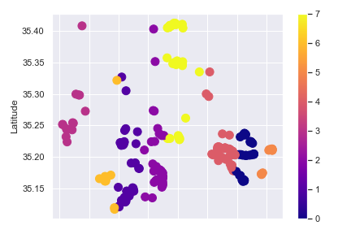
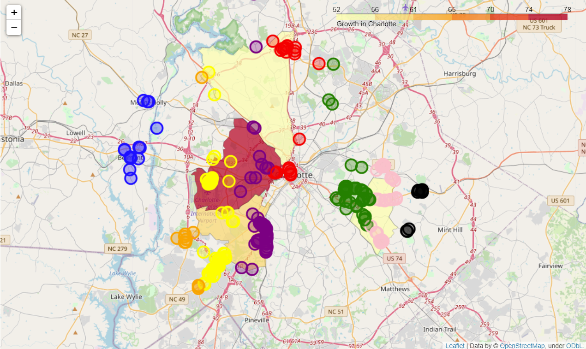

# Opening a Restaurant in North Carolina
## Introduction
North Carolina's population has grown 32.5% over the past 20 years, and the state is expected to grow by another 100,000 people per year until at least 2038, at which point the state's population will be nearly 13 million [1].  That's a lot of mouths to feed!  This is a good opportunity for forward-thinking restaurant owners and aspiring restaurateurs to make a move into markets that are in early development and are projected to grow significantly into the 2030s.

### Target Audience

According to the National Restaurant Association, there are over 19,000 eating and drinking locations in North Carolina, and restaurant and foodservice work accounts for 11% of state employment [2]!  But competition is fierce in the restaurant industry, and the median lifespan of a small startup restaurant (less than 5 employees) is only 3.75 years [3].  I am a firm believer in the value and viability of smart small businesses, so my goal with this project is to assist small businesses in identifying potential locations for food and drink establishments.

### The Challenge: Reading the Market

Wayne Gretzky, one of the greatest hockey players in history, is often credited with saying that part of his success was due to the fact that he did not skate to where the puck was but rather to where it was going.  If one can predict where the market will swing with some degree of accuracy, then they are more likely to achieve a successful business outcome.

But how to predict that in North Carolina?  One way to predict market growth is to use housing price data.  As demand for real estate increases, home prices will follow suit.  We will use average home price growth as a primary indicator of potential markets.

Another important factor to consider is competition.  Someone may have an outstanding idea for a Mexican food restaurant, but if there is already successful super deluxe burrito and salsa bar in the area of town you are interested in, it might be wise to consider other location possibilities.  We will use eatery data from Foursquare to help identify those potential locations.

## Data
Data for this report will be pulled from multiple sources:
- Housing price data will be sourced from <a href="https://www.zillow.com/research/data/" target="_blank">Zillow's publicly available research database,</a> specifically the Zillow Home Value Index (ZHVI).
- Competition (i.e. currently operating food and drink establishments) data will be sourced from Foursquare.
- Zip code geolocation coordinate data will be sourced from <a href="https://github.com/OpenDataDE/State-zip-code-GeoJSON" target="_blank">Open Data Delaware on GitHub.</a>

## Methodology & Results

This project consisted of two main components: identifying the zip codes in North Carolina experiencing large growth in average home value and then mapping food establishments to those zip codes to identify potential locations for restaurants.

The methodology can be viewed in detail in the accompanying Jupyter notebook, but I will summarize here as well.

### Identifying Target Zip Codes 

First, I downloaded and cleaned Zillow Home Value Index data for all of North Carolina and segmented out only the largest 150 zip codes in the state, figuring that the great majority of people live in those areas.  Here's a quick glimpse at the dataset:

Next, I calculated the percent growth in home value for each zip code since 2015 and added it to the dataframe.

Rather than try to focus on 150 zip codes, which would be way too much for the scope of this project and my free Foursquare API connection, I looked for outliers I could focus on instead.

From this we can see that almost everywhere has seen 15%-30% growth over the past 5 years. There are 10-15 places that have seen over 40% growth. We want to focus on them!

I separated out the top values and realized that four out of five are in the Charlotte, NC area.  I filtered out the other zip code and retained the following:

| Zip Code | City |
|------|------|
| 28208  | Charlotte |
| 28212  | Charlotte |
| 28206  | Charlotte |
| 28207  | Charlotte |

### Identifying Food Establishments in Target Zip Code Areas
Food establishments in the four target zip codes were queried using the Foursquare API and then cleaned and added to a dataframe.

I used k-Means clustering to group the restaurants and assign each a color for the Folium map.
 

 

 
The k-Means clustering was a good example of using human intelligence over the algorithm, because it initially suggested using only three clusters, which returned almost completely meaningless clusters because this project is covering a large geographic area.  In the end, I went with 8 clusters and got the following:
 

 
This provides a meaningful visual of the competitive landscape in the target zip codes, which I will discuss further in the Discussion and Conclusion section below!

## Discussion and Conclusion
One result that surprised me was that the zip code that has experienced the largest increase in real estate value is also home to the airport.  I expected the opposite, primarily because the airport requires so much empty space around it, so there isn't necessarily a lot of room for businesses.

A few different areas jumped out as potential spots for restaurants.

### Southeast Charlotte - 28212
Along US74 and Monroe Road, southeast Charlotte has a selection of restaurants, but it is not crowded.  There are several well-known chains, which could be appealing to business owners hoping to benefit from larger chains' marketing budgets and opportunistically capitalize on their traffic.

### Southwest Charlotte - 28217
Along South Blvd, the concentration of food establishments thins out considerably as you go south.  Worth noting is that the restaurants further south are small, non-chain restaurants.  This means there may not be as much traffic as the chain eateries, but it also means the rent will likely be considerably cheaper.

### North Charlotte - 28216
The large, yellow cluster in the very northern part of zip code 28216 is Northlake Mall.  I would recommend avoiding that.  It is expensive, and malls are not a hot spot.  They are generally filled with chain restaurants, and many of the shops are closing.

### West Charlotte - 28208
The major pink cluster in the 28208 zip code is the airport.  That's too expensive for a startup.  However, the purple points on the map near I85 and Mulberry Church Rd are in an area of low competition and are near airport hotels, which could be a great opportunity to cater to business travelers who are spending a per diem for their food and may, therefore, tend to purchase more.

### Final Recommendation
Ultimately, the West Charlotte (28208) area looks like an area worth investigating in more depth.  There is a lot of price growth and potentially limited competition at this point.  That said, I would also look into Southwest Charlotte (28217) for small business opportunities and reasonable lease rates.

## References

(1) <a href="https://www.ncdot.gov/about-us/how-we-operate/finance-budget/nc-first/Documents/2019-07-12-cline-presentation.pdf" target="_blank">https://www.ncdot.gov/about-us/how-we-operate/finance-budget/nc-first/Documents/2019-07-12-cline-presentation.pdf</a>  
(2) <a href="https://restaurant.org/Downloads/PDFs/State-Statistics/northcarolina.pdf" target="_blank">https://restaurant.org/Downloads/PDFs/State-Statistics/northcarolina.pdf</a> 
(3) <a href="https://www.researchgate.net/publication/267695784_Only_the_Bad_Die_Young_Restaurant_Mortality_in_the_Western_US" target="_blank">https://www.researchgate.net/publication/267695784_Only_the_Bad_Die_Young_Restaurant_Mortality_in_the_Western_US</a>